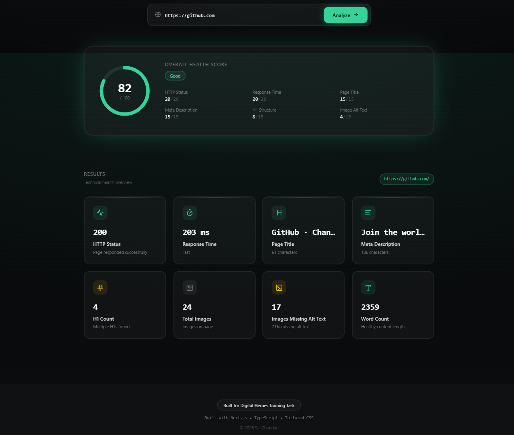
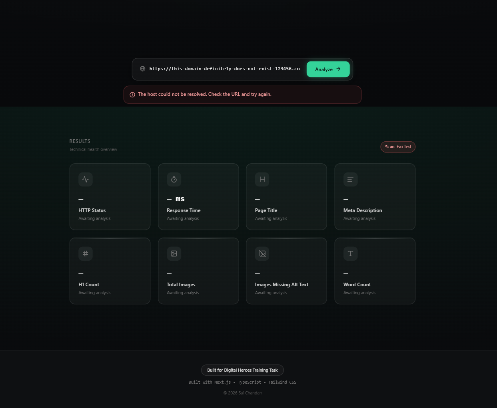

# 🚀 Page Pulse

> **Website Intelligence in Seconds**

Analyze any webpage for SEO and technical health using a clean, modern dashboard built with Next.js.

---

## 🌐 Live Demo

**Production:** https://page-pulse-green.vercel.app/


---

## ✨ Features

- 🔍 Analyze any public webpage
- ⚡ Measure HTTP response time
- 📡 Display HTTP status code
- 📝 Extract page title
- 📄 Extract meta description
- #️⃣ Count H1 headings
- 🖼️ Count total images
- ♿ Detect images missing alt text
- 📚 Estimate total word count
- 📊 Overall Health Score (100-point scoring system)
- 🌙 Responsive glassmorphism UI
- 🚨 Friendly error handling
- 🚀 Deployed on Vercel

---

## 🛠 Tech Stack

### Frontend

- Next.js
- React
- TypeScript
- Tailwind CSS
- Lucide React

### Backend

- Next.js API Routes
- Axios
- Cheerio

### Deployment

- Vercel

---

## 📸 Screenshots

### Home Page


### Results Dashboard



### Health Score



---

## 📂 Project Structure

```text
src/
├── app/
│   ├── api/
│   │   └── analyze/
│   └── page.tsx
│
├── components/
│   ├── page-pulse/
│   ├── ui/
│   ├── Footer.tsx
│   ├── Analyzer.tsx
│   └── HealthScoreCard.tsx
│
└── lib/
    └── metrics.ts
```

---

## ⚙️ Installation

Clone the repository

```bash
git clone https://github.com/chandansangamreddi-dev/page-pulse.git
```

Install dependencies

```bash
npm install
```

Run the development server

```bash
npm run dev
```

Open:

```
http://localhost:3000
```

---

## 🌐 API

### POST `/api/analyze`

Request

```json
{
  "url": "https://github.com"
}
```

Returns

```json
{
  "httpStatus": 200,
  "responseTimeMs": 850,
  "pageTitle": "...",
  "metaDescription": "...",
  "h1Count": 1,
  "totalImages": 24,
  "imagesMissingAlt": 2,
  "wordCount": 2359
}
```

---

## 📊 Health Score

Page Pulse calculates an overall health score out of **100** based on:

| Metric | Weight |
|--------|--------:|
| HTTP Status | 20 |
| Response Time | 20 |
| Page Title | 15 |
| Meta Description | 15 |
| H1 Structure | 15 |
| Image Alt Text | 15 |

Grades:

- 🟢 Excellent
- 🔵 Good
- 🟡 Needs Improvement
- 🔴 Poor

---

## 🚨 Error Handling

The API gracefully handles:

- Invalid URLs
- Invalid JSON requests
- Request timeouts
- DNS lookup failures
- Connection failures
- Non-HTML responses
- Unexpected server errors

---

## 🚀 Deployment

This project is deployed using **Vercel**.

Every push to the `main` branch automatically triggers a new production deployment.

---

## 🔮 Future Improvements

- Lighthouse integration
- Broken link detection
- Export PDF reports
- Core Web Vitals
- Accessibility scoring
- SEO recommendations
- Historical scan comparison

---

## 👨‍💻 Author

**Sai Chandan Sangamreddi**

Built as part of the **Digital Heroes Software Development Internship Task**.

---

## 📄 License

This project is intended for educational and internship evaluation purposes.